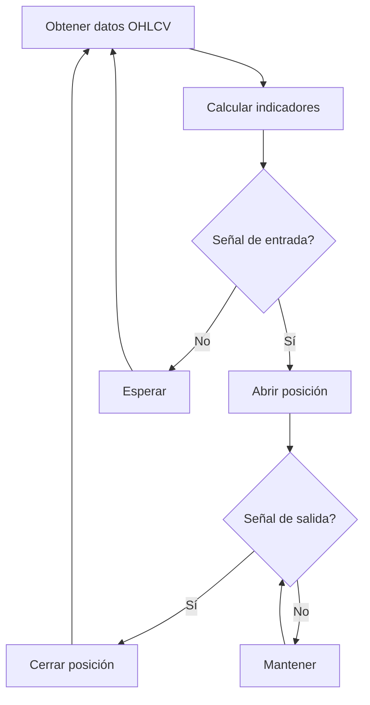
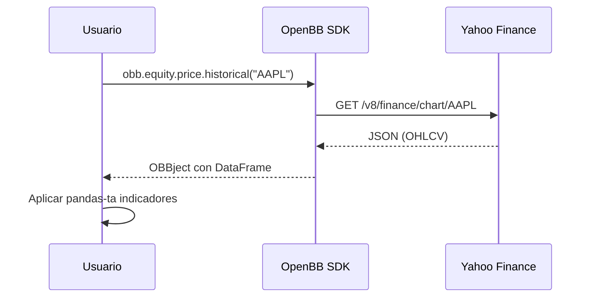
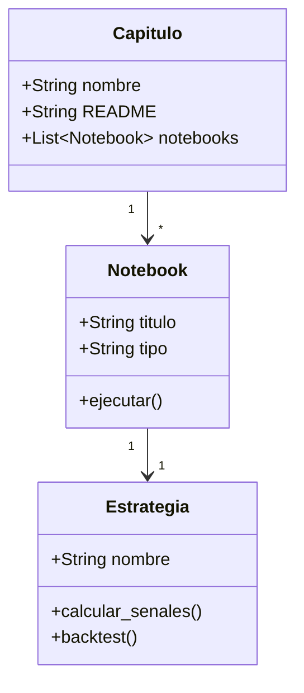

# Ejemplo de Diagramas Mermaid

Este archivo demuestra la capacidad de renderizado de diagramas Mermaid en JupyterLab
con la extensión `jupyterlab-myst`.

## Diagrama de Flujo: Estrategia de Trading

## Diagrama de Secuencia: Descarga de Datos con OpenBB

## Diagrama de Clases: Estructura del Curso

## Verificación

Si ves los diagramas renderizados como gráficos SVG (no como texto plano),
la extensión `jupyterlab-myst` está funcionando correctamente.
