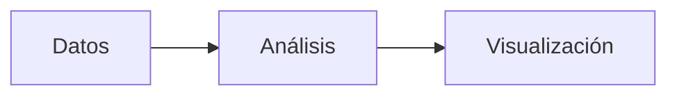

# Quickstart: JupyterLab Markdown Extensions

**Feature**: specs/003-jupyterlab-markdown-extensions

## Setup

### Opción A: Instalación automática (recomendada)

```bash
./scripts/setup_env.sh python3.11 .venv
```

La extensión `jupyterlab-myst` se instala automáticamente con el resto de dependencias.

### Opción B: Instalación manual

```bash
source .venv/bin/activate
pip install "jupyterlab-myst>=2.4"
```

## Verificación

### 1. Comprobar que la extensión está activa

```bash
source .venv/bin/activate
jupyter labextension list 2>&1 | grep "jupyterlab-myst"
```

Salida esperada: una línea mostrando `jupyterlab-myst` como habilitada.

### 2. Comprobar importación Python

```bash
python -c "import jupyterlab_myst; print('OK')"
```

### 3. Verificación visual

Arranca JupyterLab:

```bash
jupyter lab
```

Crea una celda Markdown con el siguiente contenido:

````markdown

````

Al renderizar la celda (Shift+Enter o doble-click fuera), deberías ver un diagrama SVG con tres nodos conectados.

### 4. Test de admonitions MyST

En una celda Markdown:

```markdown
:::{note}
Este es un bloque de nota renderizado con MyST.
:::
```

Se mostrará como un callout estilizado con color e icono.

## Troubleshooting

| Problema | Solución |
|----------|----------|
| Extensión no aparece en `labextension list` | Reinstalar: `pip install --force-reinstall jupyterlab-myst>=2.4` |
| Diagrama mermaid no renderiza | Verificar que se usa JupyterLab >= 4.0 (`jupyter lab --version`) |
| Markdown no renderiza MyST | Asegurar que se ejecuta JupyterLab (no Jupyter Notebook clásico) |

## Resultado de Validación

- **Fecha**: 2026-05-29
- **Versión instalada**: jupyterlab-myst 2.6.0
- **JupyterLab**: 4.5.7
- **Python**: 3.11.10
- **Estado**: ✅ Todos los pasos verificados correctamente
- **Archivo de ejemplo**: `curso/ejemplo-mermaid.md` (flowchart, sequence, classDiagram)
