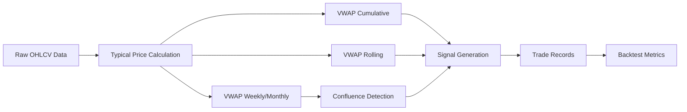

# Data Model: VWAP Indicator

**Feature**: VWAP Indicator Chapter (`capitulo-09-vwap`)
**Date**: 2026-06-01

## Overview

This document defines the data models for VWAP calculations, trading signals, and confluence zones in the VWAP chapter. All models are implemented as pandas DataFrames within Jupyter notebooks.

---

## Entity 1: VWAP Series

Represents the VWAP calculations computed from historical price and volume data.

### Fields

| Field | Type | Description |
|-------|------|-------------|
| `date` | `datetime.date` | Trading date (index) |
| `open` | `float` | Opening price |
| `high` | `float` | Highest price |
| `low` | `float` | Lowest price |
| `close` | `float` | Closing price |
| `volume` | `float` | Trading volume |
| `typical_price` | `float` | `(High + Low + Close) / 3` |
| `vwap_cumulative` | `float` | Cumulative VWAP from start of dataset |
| `vwap_rolling` | `float` | Rolling VWAP over N-day window (optional) |
| `vwap_weekly` | `float` | VWAP resampled to weekly frequency (P3) |
| `vwap_monthly` | `float` | VWAP resampled to monthly frequency (P3) |
| `sma_200` | `float` | 200-day simple moving average (trend filter) |

### Calculations

```python
# Typical Price
df['typical_price'] = (df['high'] + df['low'] + df['close']) / 3

# Cumulative VWAP
df['vwap_cumulative'] = (df['typical_price'] * df['volume']).cumsum() / df['volume'].cumsum()

# Rolling VWAP (N-day window, default 20)
df['vwap_rolling'] = (df['typical_price'] * df['volume']).rolling(window=20).sum() / df['volume'].rolling(window=20).sum()

# SMA 200 (trend filter)
df['sma_200'] = df['close'].rolling(window=200).mean()
```

### Validation Rules

- `volume` must be > 0 for VWAP calculation; rows with zero/NaN volume are dropped or forward-filled
- `typical_price` must be within [low, high] range
- `vwap_cumulative` must be monotonically smooth (no extreme jumps unless price/volume data is corrupted)

---

## Entity 2: VWAP Bounce Signal

Represents a trading signal generated when price bounces off the VWAP line.

### Fields

| Field | Type | Description |
|-------|------|-------------|
| `date` | `datetime.date` | Signal generation date |
| `ticker` | `str` | Asset ticker symbol |
| `signal_type` | `str` | `"BUY"` or `"SELL"` |
| `entry_price` | `float` | Close price at entry |
| `vwap_at_entry` | `float` | VWAP value at entry date |
| `distance_to_vwap_pct` | `float` | Percentage distance from price to VWAP at entry |
| `trend_direction` | `str` | `"UP"` if price > SMA(200), `"DOWN"` otherwise |
| `exit_price` | `float` | Close price at exit (filled when position closes) |
| `pnl_pct` | `float` | Profit/loss as percentage: `(exit - entry) / entry * 100` |
| `duration_days` | `int` | Number of trading days position was held |
| `exit_reason` | `str` | `"take_profit"`, `"stop_loss"`, or `"timeout"` |

### Signal Generation Logic

```python
# VWAP tolerance (daily data granularity)
VWAP_TOLERANCE_PCT = 0.5

# Entry conditions (Long)
buy_signal = (
    (df['close'] > df['sma_200']) &                          # Uptrend filter
    (df['close'].pct_change() > 0) &                         # Price is rising
    (abs(df['close'] - df['vwap_cumulative']) / df['vwap_cumulative'] < VWAP_TOLERANCE_PCT / 100)  # Near VWAP
)

# Entry conditions (Short)
sell_signal = (
    (df['close'] < df['sma_200']) &                          # Downtrend filter
    (df['close'].pct_change() < 0) &                         # Price is falling
    (abs(df['close'] - df['vwap_cumulative']) / df['vwap_cumulative'] < VWAP_TOLERANCE_PCT / 100)  # Near VWAP
)
```

### Exit Conditions

```python
# Take profit: +2% from entry
# Stop loss: -2% from entry
# Timeout: 10 trading days
TAKE_PROFIT_PCT = 2.0
STOP_LOSS_PCT = 2.0
TIMEOUT_DAYS = 10
```

---

## Entity 3: VWAP Confluence Zone

Represents a zone where VWAPs from multiple timeframes converge (P3 feature).

### Fields

| Field | Type | Description |
|-------|------|-------------|
| `date` | `datetime.date` | Date of confluence detection |
| `ticker` | `str` | Asset ticker symbol |
| `vwap_daily` | `float` | Daily VWAP value |
| `vwap_weekly` | `float` | Weekly VWAP value |
| `vwap_monthly` | `float` | Monthly VWAP value |
| `confluence_pct` | `float` | Maximum percentage spread between VWAP lines |
| `num_vwaps_aligned` | `int` | Number of VWAPs within confluence threshold (2 or 3) |
| `signal_type` | `str` | `"BUY"` if price above all aligned VWAPs, `"SELL"` if below |

### Confluence Detection Logic

```python
# VWAP confluence threshold
CONFLUENCE_THRESHOLD_PCT = 1.0

# Calculate pairwise spreads
spread_dw = abs(vwap_daily - vwap_weekly) / vwap_daily * 100
spread_dm = abs(vwap_daily - vwap_monthly) / vwap_daily * 100
spread_wm = abs(vwap_weekly - vwap_monthly) / vwap_weekly * 100

# Count aligned VWAPs
aligned = (spread_dw < CONFLUENCE_THRESHOLD_PCT).astype(int) + \
          (spread_dm < CONFLUENCE_THRESHOLD_PCT).astype(int) + \
          (spread_wm < CONFLUENCE_THRESHOLD_PCT).astype(int)

# Signal direction
buy_confluence = aligned >= 2 & (close > vwap_daily.max())
sell_confluence = aligned >= 2 & (close < vwap_daily.min())
```

---

## Data Flow Diagram



## Relationships

- **VWAP Series** → **VWAP Bounce Signal**: One-to-many. Each VWAP series generates zero or more bounce signals.
- **VWAP Series** → **VWAP Confluence Zone**: One-to-many. Each VWAP series generates zero or more confluence zones.
- **VWAP Bounce Signal** → **Backtest Metrics**: One-to-one aggregation. Signals are aggregated into portfolio-level metrics.
