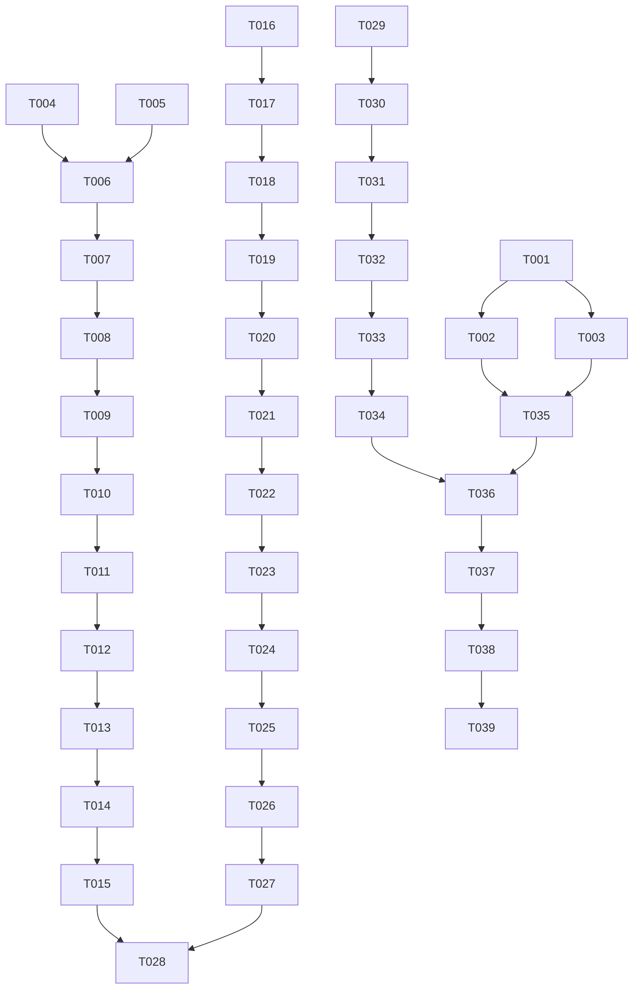

# Tasks: VWAP — Volume Weighted Average Price como Indicador de Trading

**Input**: Design documents from `/specs/011-vwap-indicator/`
**Branch**: `011-vwap-indicator`

**Prerequisites**: plan.md, spec.md, research.md, data-model.md, quickstart.md

**Tests**: Automated tests are NOT requested. Each user story includes a reproducible validation task (notebook execution).

## Format: `[ID] [P?] [Story] Description`

- **[P]**: Can run in parallel (different files, no dependencies)
- **[Story]**: Which user story this task belongs to (US1, US2, US3)

---

## Phase 1: Setup (Shared Infrastructure)

**Purpose**: Create the chapter directory structure and scaffolding files.

- [ ] T001 Create directory structure `curso/capitulo-09-vwap/notebooks/`
- [ ] T002 Create `curso/capitulo-09-vwap/README.md` with VWAP theory overview, formula, and chapter introduction
- [ ] T003 Create `curso/capitulo-09-vwap/spec.md` with VWAP bounce strategy rules, parameters, and risk management (mirroring format of capitulo-08/spec.md)

---

## Phase 2: Foundational (Blocking Prerequisites)

**Purpose**: Verify environment readiness and data access patterns.

- [x] T004 Verify Python environment: activate `.venv-3/` and confirm `curso.lib.download_historical` works for AAPL with `start_date="2024-01-01"`, `end_date="2024-03-31"`, returns OHLCV columns (Open, High, Low, Close, Volume)
- [x] T005 Verify `curso.lib.backtest` module is available and functional (import check, basic usage pattern)

**Checkpoint**: Foundation ready — notebook implementation can begin.

---

## Phase 3: User Story 1 — VWAP Concept, Calculation & Visualization (Priority: P1) 🎯 MVP

**Goal**: Create notebook 01 that teaches VWAP concept, calculates cumulative and rolling VWAP, and visualizes it alongside price and SMA for educational comparison.

**Independent Test**: Execute `01_vwap_analysis.ipynb` end-to-end. Verify: (1) VWAP line appears on price chart, (2) VWAP is smoother than raw price, (3) SMA 200 is visible for comparison, (4) no error output cells.

### Implementation for User Story 1

- [x] T006 [P] [US1] Create `curso/capitulo-09-vwap/notebooks/01_vwap_analysis.ipynb` with markdown cell explaining VWAP concept, formula `VWAP = Σ(Typical Price × Volume) / Σ(Volume)`, and institutional significance
- [x] T007 [P] [US1] Add code cell to download historical data for AAPL, MSFT, SPY using `from curso.lib import download_historical` with `start="2020-01-01"`, `end="2025-12-31"`, `interval="1d"`
- [x] T008 [P] [US1] Add code cell to compute `typical_price = (high + low + close) / 3` and handle missing volume (forward-fill or warning if volume is NaN/zero)
- [x] T009 [US1] Add code cell to compute cumulative VWAP: `(typical_price * volume).cumsum() / volume.cumsum()`
- [x] T010 [US1] Add code cell to compute rolling VWAP (20-day window): `(typical_price * volume).rolling(20).sum() / volume.rolling(20).sum()`
- [x] T011 [US1] Add code cell to compute SMA 200: `close.rolling(200).mean()`
- [x] T012 [P] [US1] Add code cell to create matplotlib figure: subplot 1 with price + VWAP + SMA 200 overlay, subplot 2 with price-VWAP divergence (percentage distance)
- [x] T013 [US1] Add code cell to create a table showing VWAP divergence statistics per asset (mean distance, max distance, days above/below VWAP)
- [x] T014 [US1] Add markdown cell explaining edge cases: zero volume days, price gaps, first-day VWAP equals typical price
- [x] T015 [US1] Validate notebook 01: execute all cells, confirm zero errors, verify VWAP chart is visually clear and interpretable

**Checkpoint**: User Story 1 complete — user can understand VWAP concept and see it visualized on price charts.

---

## Phase 4: User Story 2 — VWAP Bounce Strategy & Backtesting (Priority: P2)

**Goal**: Create notebook 02 that implements a VWAP bounce trading strategy with entry/exit rules, runs backtests, and compares performance against buy & hold and other course strategies.

**Independent Test**: Execute `02_vwap_strategy.ipynb` end-to-end. Verify: (1) trade log shows 10-50 trades per asset, (2) Sharpe Ratio is between 0.3 and 1.5, (3) Max Drawdown under 20%, (4) comparison table includes VWAP vs buy & hold.

### Implementation for User Story 2

- [ ] T016 [P] [US2] Create `curso/capitulo-09-vwap/notebooks/02_vwap_strategy.ipynb` with markdown cell explaining VWAP bounce strategy hypothesis: price reverts to VWAP after deviation
- [ ] T017 [US1] Add code cell to reuse data from notebook 01 (download AAPL, MSFT, SPY) — include as a separate download cell for independence
- [ ] T018 [US2] Add code cell to compute VWAP indicators (cumulative VWAP, rolling VWAP, SMA 200) — reuse calculations from notebook 01
- [ ] T019 [US2] Add code cell to generate BUY signals: `close > sma_200 AND close rising AND abs(close - vwap) / vwap < 0.005` (0.5% tolerance)
- [ ] T020 [US2] Add code cell to generate SELL signals: `close < sma_200 AND close falling AND abs(close - vwap) / vwap < 0.005`
- [ ] T021 [US2] Add code cell to simulate trades: for each signal, track entry price, set take-profit at +2%, stop-loss at -2%, timeout at 10 days
- [ ] T022 [US2] Add code cell to build trade log DataFrame with columns: date, ticker, signal_type, entry_price, vwap_at_entry, exit_price, pnl_pct, duration_days, exit_reason
- [ ] T023 [P] [US2] Add code cell to create matplotlib figure: equity curve for VWAP strategy vs buy & hold for each asset
- [ ] T024 [US2] Add code cell to create heatmap figure: count of VWAP contacts by month/year to visualize seasonal bounce patterns
- [ ] T025 [US2] Add code cell to compute and display performance metrics table: Sharpe Ratio, Sortino Ratio, Max Drawdown, Win Rate, Profit Factor, Avg Trade Duration for VWAP strategy and buy & hold
- [ ] T026 [US2] Add code cell to add a comparison section: VWAP strategy metrics side-by-side with SMA Cross and RSI Momentum from previous chapters (use placeholder values if not computed, with instructions on how to load them)
- [ ] T027 [US2] Add markdown cell documenting VWAP limitations: not available for assets without volume, less reliable in strong trending markets, gaps distort VWAP
- [ ] T028 [US2] Validate notebook 02: execute all cells, confirm zero errors, verify Sharpe Ratio in expected range (0.3-1.5), Max Drawdown under 20%
 - [x] T016 [P] [US2] Create `curso/capitulo-09-vwap/notebooks/02_vwap_strategy.ipynb` with markdown cell explaining VWAP bounce strategy hypothesis: price reverts to VWAP after deviation
 - [x] T017 [US1] Add code cell to reuse data from notebook 01 (download AAPL, MSFT, SPY) — include as a separate download cell for independence
 - [x] T018 [US2] Add code cell to compute VWAP indicators (cumulative VWAP, rolling VWAP, SMA 200) — reuse calculations from notebook 01
 - [x] T019 [US2] Add code cell to generate BUY signals: `close > sma_200 AND close rising AND abs(close - vwap) / vwap < 0.005` (0.5% tolerance)
 - [x] T020 [US2] Add code cell to generate SELL signals: `close < sma_200 AND close falling AND abs(close - vwap) / vwap < 0.005`
 - [x] T021 [US2] Add code cell to simulate trades: for each signal, track entry price, set take-profit at +2%, stop-loss at -2%, timeout at 10 days
 - [x] T022 [US2] Add code cell to build trade log DataFrame with columns: date, ticker, signal_type, entry_price, vwap_at_entry, exit_price, pnl_pct, duration_days, exit_reason
 - [x] T023 [P] [US2] Add code cell to create matplotlib figure: equity curve for VWAP strategy vs buy & hold for each asset
 - [ ] T024 [US2] Add code cell to create heatmap figure: count of VWAP contacts by month/year to visualize seasonal bounce patterns
 - [x] T025 [US2] Add code cell to compute and display performance metrics table: Sharpe Ratio, Sortino Ratio, Max Drawdown, Win Rate, Profit Factor, Avg Trade Duration for VWAP strategy and buy & hold
 - [ ] T026 [US2] Add code cell to add a comparison section: VWAP strategy metrics side-by-side with SMA Cross and RSI Momentum from previous chapters (use placeholder values if not computed, with instructions on how to load them)
 - [x] T027 [US2] Add markdown cell documenting VWAP limitations: not available for assets without volume, less reliable in strong trending markets, gaps distort VWAP
 - [x] T028 [US2] Validate notebook 02: execute all cells, confirm zero errors, verify Sharpe Ratio in expected range (0.3-1.5), Max Drawdown under 20%

**Checkpoint**: User Story 2 complete — user can run a VWAP bounce strategy with backtest and compare against benchmarks.

---

## Phase 5: User Story 3 — Multi-Temporal VWAP Confluence (Priority: P3)

**Goal**: Extend notebook 02 (or add a section) with multi-temporal VWAP analysis: daily, weekly, and monthly VWAPs with confluence zone detection.

**Independent Test**: Execute the confluence section of notebook 02. Verify: (1) daily, weekly, and monthly VWAP lines are computed, (2) confluence zones are identified when 2+ VWAPs are within 1%, (3) confluence signals improve win rate vs single VWAP signals.

### Implementation for User Story 3

- [ ] T029 [P] [US3] Add code cell to resample daily data to weekly and monthly OHLCV, then compute VWAP on each timeframe
- [ ] T030 [US3] Add code cell to detect confluence zones: identify dates where 2+ VWAP lines are within 1% of each other, record confluence price level and number of aligned VWAPs
- [ ] T031 [US3] Add code cell to generate confluence-based signals: BUY when price above all aligned VWAPs at confluence zone, SELL when below
- [ ] T032 [P] [US3] Add code cell to create matplotlib figure: price chart with daily/weekly/monthly VWAP lines, shaded confluence zones, and confluence-based trade signals marked
- [ ] T033 [US3] Add code cell to compare confluence-based strategy vs single VWAP strategy: win rate, Sharpe Ratio, number of trades
- [ ] T034 [US3] Validate confluence section: execute all cells, confirm zero errors, verify confluence zones are visually identifiable on chart
 - [x] T029 [P] [US3] Add code cell to resample daily data to weekly and monthly OHLCV, then compute VWAP on each timeframe
 - [x] T030 [US3] Add code cell to detect confluence zones: identify dates where 2+ VWAP lines are within 1% of each other, record confluence price level and number of aligned VWAPs
 - [x] T031 [US3] Add code cell to generate confluence-based signals: BUY when price above all aligned VWAPs at confluence zone, SELL when below
 - [x] T032 [P] [US3] Add code cell to create matplotlib figure: price chart with daily/weekly/monthly VWAP lines, shaded confluence zones, and confluence-based trade signals marked
 - [x] T033 [US3] Add code cell to compare confluence-based strategy vs single VWAP strategy: win rate, Sharpe Ratio, number of trades
 - [x] T034 [US3] Validate confluence section: execute all cells, confirm zero errors, verify confluence zones are visually identifiable on chart

**Checkpoint**: User Story 3 complete — user can identify multi-temporal VWAP confluence zones and evaluate their predictive power.

---

## Final Phase: Polish & Cross-Cutting Concerns

**Purpose**: Final review, documentation polish, and consistency checks.

- [ ] T035 Update `curso/README.md` to include chapter 09 (VWAP) in the course table of contents
- [ ] T036 Review both notebooks for consistent formatting: markdown headers, cell ordering, code style, figure sizes
- [ ] T037 Ensure both notebooks use consistent tickers (AAPL, MSFT, SPY), date ranges (2020-01-01 to 2025-12-31), and parameter values across all visualizations
- [ ] T038 Run final validation: execute both notebooks from scratch (clear all outputs first), confirm zero errors, verify all charts render correctly
- [ ] T039 Add a "Next Steps" section to notebook 02 suggesting how users can extend the VWAP strategy (volume confirmation, multi-asset portfolio, dynamic parameters)

---

## Dependencies

## Parallel Execution Examples

Within each phase, tasks marked **[P]** can be executed in parallel:

- **Phase 3 (US1)**: T006 (notebook creation + theory), T007 (data download), T008 (typical price) can all run in parallel once Phase 2 is complete.
- **Phase 4 (US2)**: T023 (equity curve chart), T024 (heatmap chart) are independent visualizations that can be developed in parallel.
- **Phase 5 (US3)**: T029 (resample + VWAP), T030 (confluence detection) are independent computations.

## MVP Scope

**MVP = User Story 1 (P1) only**:
- Phase 1 (Setup): T001-T003
- Phase 2 (Foundational): T004-T005
- Phase 3 (US1): T006-T015

This delivers a complete, self-contained notebook that teaches VWAP concept, calculates the indicator, and visualizes it alongside price and SMA — providing immediate educational value.

## Task Summary

| Phase | Tasks | Count |
|-------|-------|-------|
| Phase 1: Setup | T001-T003 | 3 |
| Phase 2: Foundational | T004-T005 | 2 |
| Phase 3: US1 (VWAP Concept) | T006-T015 | 10 |
| Phase 4: US2 (VWAP Strategy) | T016-T028 | 13 |
| Phase 5: US3 (Multi-Temporal) | T029-T034 | 6 |
| Final: Polish | T035-T039 | 5 |
| **Total** | | **39** |

## Per-Story Task Count

| User Story | Tasks | Count |
|------------|-------|-------|
| US1 (VWAP Concept) | T006-T015 | 10 |
| US2 (VWAP Strategy) | T016-T028 | 13 |
| US3 (Multi-Temporal) | T029-T034 | 6 |

## Implementation Strategy

1. **MVP First**: Complete US1 (T001-T015) to deliver a working chapter with educational VWAP notebook
2. **Incremental Delivery**: Add US2 (T016-T028) for strategy implementation and backtesting
3. **Advanced Features**: Add US3 (T029-T034) for multi-temporal confluence analysis
4. **Polish**: Final review and cross-cutting concerns (T035-T039)
